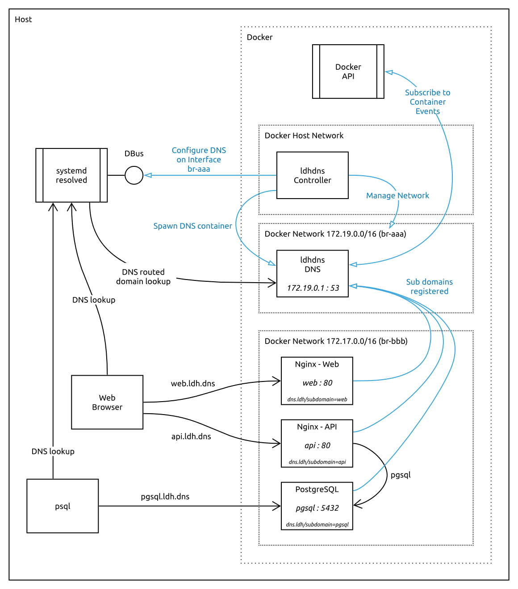

# Local Docker Host DNS - ldhdns

A developer tool for providing DNS for Docker containers running on a single host.

## Why?

Consider a scenario where you have a Single Page Application (SPA) website, a REST API and PostgreSQL each running within Docker containers on your local development machine. The HTTP services are accessible on port `80` and the PostgreSQL service on port `5432`.

To access these services from the development machine (host) you need to:

1. Map the container ports to host ports and access the services using `localhost` and the host port number,
2. Use the IP address of the respective container together with the container port number,
3. Manually add entries to your `/etc/hosts` file, mapping the container IP addresses to DNS names.

Each of these methods have short-comings and/or issues, such as when:

* Multiple services use the same port numbers.
* There isn't a convention for mapping host port numbers.
* Figuring out the IP address of containers.
* Manually editing `/etc/hosts`.
* Having to update `/etc/hosts` when an IP address changes.
* Running containers with a static IP address, that `/etc/hosts` doesn't need to change.
* Complicated scripts to inspect containers to obtain IP addresses and/or scripting configurations.
* Portability issues for other developers on their machines.
* More configuration required so that the application can run in development and deployed environments without code changes.

In the above example, to access the SPA website with a browser, a typical host to container port mapping could be `8080` to `80` to use the URL `http://localhost:8080` and the REST API mapped to `8090` which would require the SPA application to be configured to use `http://localhost:8090` for the API. Furthermore, you may want to run some ad-hoc SQL queries whilst debugging, so connecting a tool such as `psql` would require a further port mapping of say `85432` to `5432` for PostgreSQL.

As you can see, this gets complicated quickly and isn't a great developer experience!

Now imagine adding SSL ports (`443`) so that you can debug under more production like conditions; the situation gets nasty fast.

Don't even think about using `docker-compose up --scale SERVICE=NUM` with more than one instance of a service!

## Solution

`ldhdns` provides a simple solution, where containers are able to declaratively provide a DNS name which is
dynamically resolveable on the development machine to the container and the _actual service ports_ can be used, just like in production.

The only requirement is that your containers have a unique IPv4 and/or IPv6 address. I.e. They can't run on the host Docker network.

So in the above mentioned example, you could have `web.ldh.dns`, `api.ldh.dns` and `pgsql.ldh.dns` for the respective services, and the SPA website could be configured by convention to use `api` as a sub-domain of the current domain to access the REST API. The website URL would be `http://web.ldh.dns` and the host for connecting `psql` would be `pgsql.ldh.dns`.

No need for port mappings, needing to know the IP addresses of containers, manual editing of `/etc/hosts` or having funky configuration to manage differences between development and production.

Happy developer!

## Requirements

* Linux operating system (e.g. Ubuntu)
* Docker
* [`systemd-resolved`][resolved] service

## Usage

### The Controller

Start the controller container, attached to the Docker host network, and optionally provide the domain name suffix to use in the `LDHDNS_DOMAIN_SUFFIX` environment variable.

**Security Note:** The container needs to mount the Docker socket so that it can consume the Docker API, and is run with the `apparmor=unconfined` security option and mounts the SystemBus Socket so that it is able to configure `systemd-resolved` dynamically.

```
docker run \
  --detach \
  --network host \
  --restart always \
  --security-opt "apparmor=unconfined" \
  --env LDHDNS_DOMAIN_SUFFIX=ldh.dns \
  --volume "/var/run/docker.sock:/tmp/docker.sock" \
  --volume "/var/run/dbus/system_bus_socket:/var/run/dbus/system_bus_socket" \
  virtualstaticvoid/ldhdns:0.1.0
```

Additionally, the `LDHDNS_SUBDOMAIN_LABEL` environment variable can be used to override the label used by containers. The default label is `dns.ldh/subdomain`.

### Your Containers

For the containers needing DNS, add a `dns.ldh/subdomain=<sub-domain>` label with the desired sub-domain. The sub-domain will be appended to the domain name given in the `LDHDNS_DOMAIN_SUFFIX` environment variable of the controller to form a fully qualified domain name.

To apply the label; for example from the command line:

```
docker run -it --label "dns.ldh/subdomain=foo" nginx
```

Or with Docker Compose:

```
services:
  web:
    image: nginx
    labels:
      "dns.ldh/subdomain": "foo"
```

*Note*: Labels cannot be added to an already running container so you will need to re-create containers to apply the label.

### Consuming

Now you will be able to access the respective container using it's fully qualified domain name from the host.

For example, visiting `http://foo.ldh.dns` with your browser, or using `curl` from the command line:

```
curl -v http://foo.ldh.dns
```

Or `psql` connecting to a PostgreSQL container:

```
psql --host foo.ldh.dns
```

### Building

Use `make` to build the `ldhdns` docker image.

### Debugging

You can query the DNS records to check that it works by using `dig`:

```
dig -t ANY foo.ldh.dns

...
; <<>> DiG 9.16.1-Ubuntu <<>> -t A foo.ldh.dns
;; global options: +cmd
;; Got answer:
;; ->>HEADER<<- opcode: QUERY, status: NOERROR, id: ...
...

;; ANSWER SECTION:
foo.ldh.dns.    600 IN  A 172.18.0.3
foo.ldh.dns.    600 IN  AAAA fc00:f853:ccd:e793::3
...
```

And cross-checking with the IP addresses of each running container labelled with `dns.ldh/subdomain`:

```
docker ps --filter='label=dns.ldh/subdomain=foo' --format "{{.ID}}" | \
  xargs docker inspect --format '{{range .NetworkSettings.Networks}}{{.IPAddress}} [{{.GlobalIPv6Address}}]{{end}}' --

...
172.18.0.3 [fc00:f853:ccd:e793::3]
```

## How It Works

_TBC_

The following digram illustrates the components which make up the solution, and how they interact with the host machine, the docker API, systemd-resolved and other applications such as a browser or psql.



## Inspiration

* I got tired of running `docker inspect`, figuring out the container name, and manually editing `/etc/hosts`.
* I couldn't come up with a consistent convention for mapping host to container ports. What comes after 8099?

## Credits

* [Configure systemd-resolved to use a specific DNS nameserver for a given domain][brasey]
* [How to configure systemd-resolved and systemd-networkd to use local DNS server for resolving local domains and remote DNS server for remote domains][stackexchange]
* [`dnsmasq` Tips and Tricks][dnsmasq-tips]
* [`dnsmasq`][dnsmasq]
* [`systemd-resolved`][resolved]
* [github.com/jonathanio/update-systemd-resolved][jonathanio]
* [github.com/programster/docker-dnsmasq][programster]

## License

MIT License. Copyright (c) 2020 Chris Stefano. See [LICENSE](LICENSE) for details.

<!-- links -->

[brasey]: https://gist.github.com/brasey/fa2277a6d7242cdf4e4b7c720d42b567#solution
[dnsmasq-tips]: https://www.linux.com/topic/networking/advanced-dnsmasq-tips-and-tricks/
[dnsmasq]: http://www.thekelleys.org.uk/dnsmasq/doc.html
[jonathanio]: https://github.com/jonathanio/update-systemd-resolved
[programster]: https://github.com/programster/docker-dnsmasq
[resolved]: https://www.freedesktop.org/wiki/Software/systemd/resolved/
[stackexchange]: https://unix.stackexchange.com/a/442599
