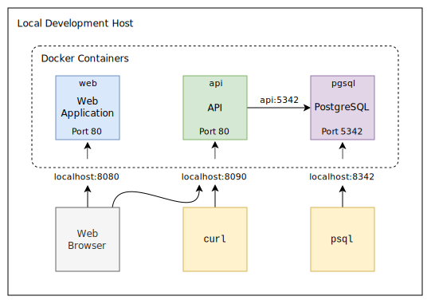
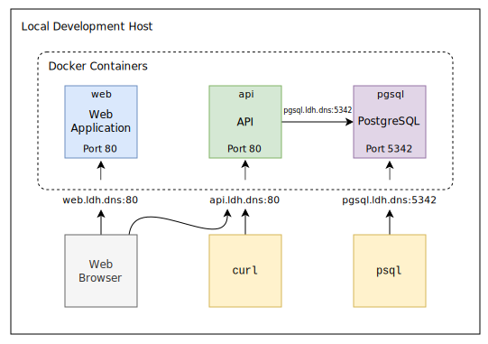
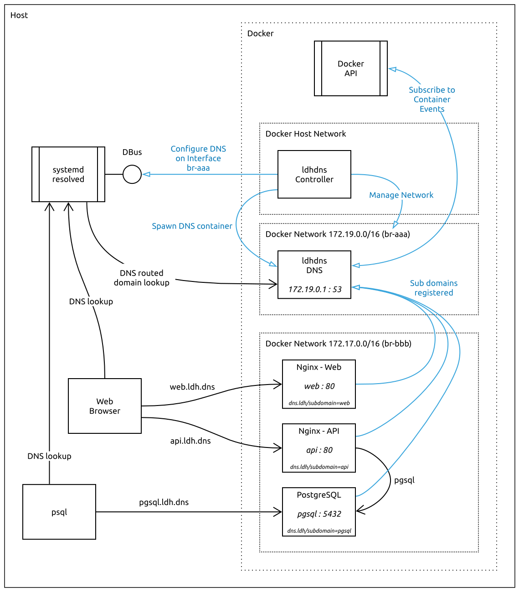

# Local Docker Host DNS - ldhdns

[](https://github.com/virtualstaticvoid/ldhdns/actions/workflows/build-publish.yml)

A developer tool for providing DNS for Docker containers running on a local Linux development host.

## Requirements

* Linux operating system (e.g. Ubuntu)
* [`systemd-resolved`][resolved] service (enabled and running)
* [`docker`][docker] (`>= 20.10`)
* [`docker-compose`][docker-compose] (`>= 1.27`)
* _optionally_, [`curl`][curl]
* _optionally_, [`psql`][psql]

## How it Works

`ldhdns` works by running a controller and a lighweight DNS server as docker containers.

The controller manages the DNS server and configures `systemd`'s [`resolved`][resolved] to use it.

The DNS server, uses the Docker API to monitor when containers are started and stopped, and uses
specific labels of the containers for the subdomain name to use.

The domain names are dynamically resolveable on the host _and_ from within containers, so that
the same names can be used in either scenario, and with the _actual service ports_ so no
container to host port mappings are required.

## Usage

### The Controller

Start the controller, attaching it to the host network, as follows:

**Security Note:** The container mounts the Docker socket so that it can consume the Docker API
and it is run with the `apparmor=unconfined` security option and mounts the SystemBus socket so
that it is able to configure `systemd-resolved` dynamically. Please inspect the [code][ldhdns]
and build the image yourself if you are concerned about security.

```bash
LDHDNS_CONTAINER_NAME=ldhdns

docker run \
  --name $LDHDNS_CONTAINER_NAME \
  --detach \
  --network host \
  --security-opt "apparmor=unconfined" \
  --volume "/var/run/docker.sock:/tmp/docker.sock" \
  --volume "/var/run/dbus/system_bus_socket:/var/run/dbus/system_bus_socket" \
  --env LDHDNS_CONTAINER_NAME=$LDHDNS_CONTAINER_NAME \
  --restart unless-stopped \
  ghcr.io/virtualstaticvoid/ldhdns:latest
```

Visit the [`virtualstaticvoid/ldhdns` image repository][ghcr] for available image tags.

### Configuration

The network ID, domain name suffix and subdomain label are configured with environment variables:

* `LDHDNS_NETWORK_ID` for docker network name to use. The default is `ldhdns`.
* `LDHDNS_DOMAIN_SUFFIX` for domain name suffix to use. The default is `ldh.dns`.
* `LDHDNS_SUBDOMAIN_LABEL` for label used by containers. The default is `dns.ldh/subdomain`.
* `LDHDNS_CONTAINER_NAME` for the container name of the controller. The default is `ldhdns`.

**NOTE:** The `LDHDNS_CONTAINER_NAME` environment variable is required since the controller needs
to be able to obtain the ID of the container which it is executing in. The OCI
[runtime specification][runtime-spec] doesn't currently provide a portable way to obtain the
container ID from within and using hacks such as via [`/proc/self/cgroup`][container-id-hack1] and
[`/proc/1/cpuset`][container-id-hack2] have proven to be unreliable.

### Overridding the Domain Name

You can provide your own domain name via the `LDHDNS_DOMAIN_SUFFIX` environment variable as follows:

```bash
LDHDNS_CONTAINER_NAME=ldhdns

docker run \
  --name $LDHDNS_CONTAINER_NAME \
  --env LDHDNS_DOMAIN_SUFFIX=ldh.example.com \
  --detach \
  --network host \
  --security-opt "apparmor=unconfined" \
  --volume "/var/run/docker.sock:/tmp/docker.sock" \
  --volume "/var/run/dbus/system_bus_socket:/var/run/dbus/system_bus_socket" \
  --env LDHDNS_CONTAINER_NAME=$LDHDNS_CONTAINER_NAME \
  --restart unless-stopped \
  ghcr.io/virtualstaticvoid/ldhdns:latest
```

**Tip:** If you are using a "real" domain name, be sure to use a subdomain off the apex domain,
such as `ldh.` to avoid any clashes with it's public DNS resolution.

E.g. Use `ldh.example.com` for the domain name so that a container "`foo`" will be resolvable
to `foo.ldh.example.com` instead of `foo.example.com`.

### Containers

To make containers resolvable, add the label "`dns.ldh/subdomain=<subdomain>`" with the desired
subdomain to use.

This subdomain will be prepended to the domain name in the `LDHDNS_DOMAIN_SUFFIX` environment
variable to form a fully qualified domain name.

To apply the label to a container using the command line:

```bash
docker run -it --rm --label "dns.ldh/subdomain=foo" nginx
```

Or with Docker Compose:

```yaml
# docker-compose.yml
services:
  web:
    image: nginx
    labels:
      "dns.ldh/subdomain": "foo"
```

*Note*: Make sure to use the _same label key_ you provided in the `LDHDNS_SUBDOMAIN_LABEL`
environment variable.

*Note*: Labels cannot be added to existing containers so you will need to re-create them to
apply the label if needed.

### Testing

Start by running Nginx in a container:

```bash
docker run --detach --label "dns.ldh/subdomain=foo" nginx
```

The subdomain provided will now be resolvable to the container IP address.

E.g.

```bash
dig -t A foo.ldh.dns

; <<>> DiG 9.16.1-Ubuntu <<>> -t A foo.ldh.dns
;; global options: +cmd
;; Got answer:
;; ->>HEADER<<- opcode: QUERY, status: NOERROR, id: 61163
...

;; ANSWER SECTION:
foo.ldh.dns.    15  IN  A 172.17.0.2

...
```

And you can go ahead and consume the service.

From a terminal running on the host:

```bash
curl -v http://foo.ldh.dns

<!DOCTYPE html>
<html>
...
<h1>Welcome to nginx!</h1>
...
</html>
```

Or from within another container:

```bash
docker run -it --rm curlimages/curl -v http://foo.ldh.dns

<!DOCTYPE html>
<html>
...
<h1>Welcome to nginx!</h1>
...
</html>
```

## Hacking

The development experience is based on [docker compose][docker-compose].
The [docker-compose.yml](docker-compose.yml) file contains two instances of the `ldhdns` service;
one configured using the defaults and the other with an alternative configuration.
It also contains sample services with `nginx` and `postgres` so that tests can be conducted
against these types of services.

The default configuration uses the `ldh.dns` DNS suffix with the `dns.ldh/subdomain` label,
and the alternative configuration uses the `alt.dns` DNS suffix with the `alt.ldh/subdomain` label.

### Building

Use `docker compose build` to build the `ldhdns` docker image locally.

### Running

Use `docker compose up` to run the services locally.

### Testing

Once the services are running, use `docker compose run test` to run the tests from within the `test`
service, execute [`test.sh`](test.sh) directly from your host, which uses the `curl` and `psql` tools,
or navigate to the following URL's with your web browser:

* [http://web.ldh.dns](http://web.ldh.dns)
* [http://web2.alt.dns](http://web2.alt.dns)

## Background

Consider a scenario in development where you are building a Single Page Web Application (SPA) and
REST API, with a PostgreSQL database, with each service running in Docker containers on your
local machine.



A web browser connects to the Web Application and the REST API, and the API connects to the
PostgreSQL database.

In development, to access these services there are number of options:

1. Map the container ports to host ports and access the services using `localhost` together with the host port number,
2. Obtain the IP address of each respective container and access the services using the IP address together with the container port number,
3. Using domain names instead of IP addresses, adding them to your `/etc/hosts`, mapping each container IP address to a name.

Each of these methods have difficulties, short-comings and implications, such as:

* No consistent convention for mapping container ports to host ports.
* Potential host port clashes when running multiple instances of a container.
* Manual steps needed to get the IP addresses of containers.
* Editing `/etc/hosts` requires root permissions.
* Manual updates to `/etc/hosts` required each time an IP address changes.
* Portability issues for other developers on their machines when collaborating on projects.
* Configuration differences on the host vs within the container.

Furthermore, when host to container port mappings are typically used, the mapping could
be `8080` to `80` for the Web Application and `8090` to `80` for the REST API. The SPA Web
Application would therefore have to be configured to use `http://localhost:8090` to access
the API. However the API connects directly to PostgreSQL so it would have to configured to
use the PostgreSQL container name.

You may also want to run some ad-hoc SQL queries whilst debugging, so connecting a tool such
as `psql` would require a further port mapping of `8432` to `5432`.

As you can see this setup gets messy and complicated quickly and isn't a great developer experience!

Now imagine adding SSL ports (`443`) so that you can debug under more production like conditions
with TLS certificates; the situation gets nasty fast. Don't even think about having more than
one instance of a container, such as when using the `docker-compose up --scale api=N` to add
more container instances of a service!

## Solution

`ldhdns` provides a simple solution. It monitors running containers, looking for labels which
contain the domain name to use, and configures and runs a lightweight DNS server.

The domain names are dynamically resolveable on the host _and_ from within containers, so that
you can use the same fully qualified domain names in each scenario and use
the _actual service ports_ just like in production.

In the above mentioned example, you could use `web`, `api` and `pgsql` as the subdomains for
the respective containers, making the Web Application and REST API accessible
via `http://web.ldh.dns` and `http://api.ldh.dns` respectively, and the PostgreSQL service
accessible via `pgsql.ldh.dns`.



## Architecture

`ldhdns` consists of two services which are packaged in the same Docker container.

The following diagram illustrates the components which make up the solution, and how they
interact with the host machine, the docker API, systemd-resolved and other applications such
as a browser or psql.



The controller creates and configures a Docker bridge network and configures `systemd-resolved`
to [resolve DNS queries][resolved-config] for the configured domain name. It spawns a second
container to monitors the Docker API for when containers are started or stopped, creating and
removing DNS records accordingly, and runs `dnsmasq` to resolve DNS queries for `A` (ipv4)
and `AAAA` (ipv6) type records for the configured domain.

## Inspiration

* I got tired of running `docker ps` to figure out the container name, followed by `docker inspect` to get the IP address and then manually editing `/etc/hosts`.
* I couldn't come up with a consistent convention for mapping host to container ports. What comes after 8099?
* Finding IPv4 and IPv6 CIDR blocks which aren't in use so that static IP's can be used.
* Not being able to create SSL certificates for `*.xip.io` or `*.nip.io` domains.

## Credits

* [Configure systemd-resolved to use a specific DNS nameserver for a given domain][brasey]
* [How to configure systemd-resolved and systemd-networkd to use local DNS server for resolving local domains and remote DNS server for remote domains][stackexchange]
* [`dnsmasq`][dnsmasq]
* [`dnsmasq` Tips and Tricks][dnsmasq-tips]
* [github.com/programster/docker-dnsmasq][programster]
* [`systemd-resolved`][resolved]
* [github.com/jonathanio/update-systemd-resolved][jonathanio]

## License

MIT License. Copyright (c) 2020 Chris Stefano. See [LICENSE](LICENSE) for details.

<!-- links -->

[brasey]: https://gist.github.com/brasey/fa2277a6d7242cdf4e4b7c720d42b567#solution
[container-id-hack1]: https://stackoverflow.com/a/25729598/30521
[container-id-hack2]: https://stackoverflow.com/a/52988227/30521
[curl]: https://curl.se/
[dnsmasq-tips]: https://www.linux.com/topic/networking/advanced-dnsmasq-tips-and-tricks/
[dnsmasq]: http://www.thekelleys.org.uk/dnsmasq/doc.html
[docker-compose]: https://docs.docker.com/compose/install
[docker]: https://docs.docker.com/get-started
[ghcr]: https://github.com/virtualstaticvoid/ldhdns/pkgs/container/ldhdns
[jonathanio]: https://github.com/jonathanio/update-systemd-resolved
[ldhdns]: https://github.com/virtualstaticvoid/ldhdns
[programster]: https://github.com/programster/docker-dnsmasq
[psql]: https://www.postgresql.org/docs/current/app-psql.html
[resolved-config]: https://www.freedesktop.org/software/systemd/man/systemd-resolved.service.html#Protocols%20and%20Routing
[resolved]: https://www.freedesktop.org/wiki/Software/systemd/resolved/
[runtime-spec]: https://github.com/opencontainers/runtime-spec/issues/1105
[stackexchange]: https://unix.stackexchange.com/a/442599
